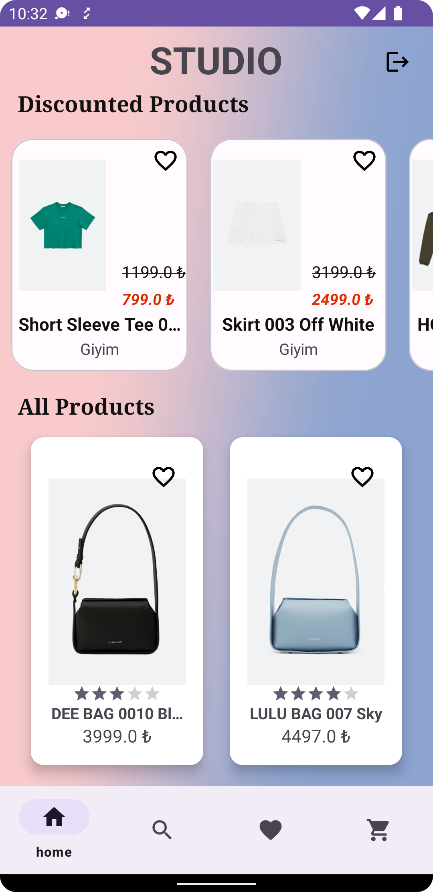

# E-Commerce-UpSchool
 UpSchool Capstone Project

# System I used
- MVVM
- Navigation Component
- Retrofit
- Room
- Chuker
- Glide
- Firebase Auth
- Coroutines
- Hilt

## Screens

| Splash | Home | Detail |
| ------ | ---- | ------ |
||||

 

| Favorites | Search |
| --------- | ------ |

|||

 

| Cart | Payment | Success |
| ---- | ------- | ------- |
||||
